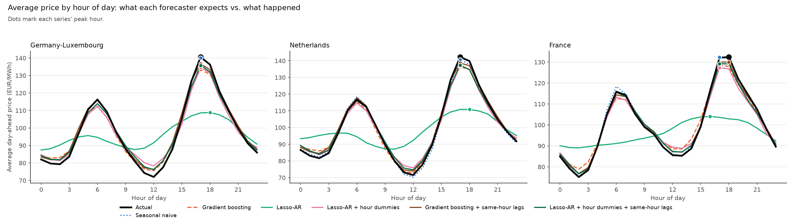

# Forecast-aware battery scheduling

An end-to-end, backtested study of a merchant, grid-connected battery trading day-ahead
electricity. The pipeline forecasts next-day prices, turns forecast uncertainty into
scenarios, solves a risk-aware stochastic dispatch, and is graded on what the schedule
actually earns against real market prices, not on forecast error.

## Summary

A 1 MW / 2 MWh battery with no site load or PV — a price-taker that only ever trades the
day-ahead spread — is walk-forward backtested against six years of ENTSO-E day-ahead prices
(2019–2025) in three markets: Germany-Luxembourg, the Netherlands and France. At every origin,
each of six forecasters is refit on data strictly before that day, forecasts the next 24 hours,
and a schedule is optimised and priced against what actually happened; a perfect-foresight
oracle (the same optimiser given the realised prices) sets the ceiling.

MAE is a poor guide to which forecaster earns more. Across all three markets, ranking
forecasters by MAE gives close to no relationship with realised revenue (model-level Spearman
ρ between +0.26 and +0.54), while ranking them by Kendall's τ or by recall of the day's most
expensive hours orders them almost perfectly (ρ = 0.80–1.00). Comparing forecasters on the
same day removes each day's difficulty and tells the same story: τ tracks revenue markedly
better than MAE in every market (day-demeaned correlation +0.25 to +0.34 higher, 95% CI
excluding zero all three times).

The forecasters that do well share two features: 24 hour-of-day dummies (so the model can place
a morning peak, an evening peak, and a midday trough separately, rather than one smooth hump)
and lags aligned to the *target* hour rather than to the forecast origin (the same-hour-
yesterday, same-hour-last-week information a seasonal-naive baseline gets for free by
construction). A linear model with neither loses badly to naive in all three markets — in France,
outright unprofitable. A linear model with both edges past naive in every one of the 21
market-years studied, by a modest but consistently positive margin (2–8% of oracle revenue; the
three markets' 95% confidence intervals on the gap all exclude zero). Gradient boosting, given
the same aligned lags, has the lowest MAE of any candidate in every market — and lower revenue
than the linear model that beats it on τ, the same MAE-vs-value gap that motivates this project,
now showing up *within* a single controlled feature comparison, not just between naive and ML.

A smaller, earlier household-scale study (13.5 kWh / 5 kW behind a real German meter,
30-day backtests) motivated this one and is kept as a [companion study](docs/household_study.md);
it is where the CVaR/scenario layer is actually tested (§4 there), since re-running it at
market scale is too expensive to be worth it once the effect there tested out at zero.

### Key result: 1 MW / 2 MWh, three markets, 2019–2025

| Market | Evaluated days | Oracle (EUR/MW/yr) | Naive capture | Best candidate capture | Best − naive (EUR/MW/yr, 95% CI) |
|---|---:|---:|---:|---:|---|
| Germany-Luxembourg | 2,329 (daily) | 48,319 | 73.4% | 77.5% | +1,968 [+1,330, +2,617] |
| Netherlands | 1,165 (every 2nd day) | 51,921 | 66.9% | 72.9% | +3,119 [+2,129, +4,208] |
| France | 1,165 (every 2nd day) | 34,811 | 63.1% | 66.5% | +1,152 [+19, +2,253] |

"Best candidate" is Lasso-AR with hour dummies and target-aligned lags in all three markets (§4.1).

## 1. Research questions

1. A few 2025–26 papers ([arXiv:2604.12082](https://arxiv.org/abs/2604.12082), [arXiv:2511.13616](https://arxiv.org/abs/2511.13616)) report that MAE tracks a forecast's economic value to battery arbitrage poorly, and that rank correlation tracks it better, on household-scale backtests. Does that hold at market scale — a merchant battery, three countries, six years — and when a forecaster's ranking fails, what is the cause?
2. Does the MAE–value disconnect, and the relative ranking of forecasters, persist as the price regime changes — from the calm 2019–20 markets through the 2022 gas-crisis prices to the more volatile 2023–25 markets — within each of the three countries?

## 2. Methodology

### 2.1 Pipeline

```
history.csv ──▶ forecast (per candidate) ──▶ point-forecast LP ──▶ realised revenue
 (day-ahead price,   six candidates              deterministic dispatch,       vs. perfect-foresight
  residual load)      (§2.3)                     1.5 cycles/day cap             oracle
```

1. **Forecasting** (`battery_schedule/forecast.py`). Direct multi-step forecasts: one model per horizon step (1..24h), trained only on features known at the origin. Price is forecast using its own lags and system-wide residual load (actual grid load minus wind and solar generation, ENTSO-E) as an exogenous driver, substituted at inference time by a forecast of itself (the same train-on-actual/deploy-on-forecast pattern real EPF models use for TSO-published forecasts). Price forecasts are not clipped at zero, since day-ahead prices go negative.
2. **Evaluation** (`pipeline._backtest`, `mode: deterministic`). At every origin, each candidate is forecast and its point forecast alone is turned into a schedule (`_plan_deterministic`), then priced against what actually happened. `_plan_deterministic()` takes only the training history and the forecast, so nothing from the day being priced can leak in; a regression test distorts every realised value on the final day and checks the schedule doesn't move. A perfect-foresight oracle (the same optimiser, given the realised prices) is computed per day. The scenario/CVaR layer is not run at this scale — with 6 candidates × up to 2,329 days × 30 scenarios per market it would be prohibitively slow, and the [companion study](docs/household_study.md) already found it adds nothing measurable in either price regime it tested.
3. **Optimization** (`battery_schedule/optimise.py`). A linear program: charge, discharge and state of charge for a 1 MW / 2 MWh battery (round-trip efficiency 0.92 × 0.92 = 84.6%, capped at 1.5 full-equivalent cycles/day, degradation cost 0.005 EUR/kWh on both charge and discharge = 10 EUR/MWh of round-trip throughput). No site load or PV: revenue is minus the realised grid cost. A merchant sells at the same day-ahead price it buys at (`export_price_ratio = 1.0`), unlike the household study's 0.75. Solved with SciPy/HiGHS.
4. **Model selection** happens only in `run()`'s next-day step, which must commit to one schedule for tomorrow (by validation MAE). The backtest skips it: every candidate is evaluated on its own, independently, every day.

### 2.2 Forecast candidates

Two design choices, applied separately and together, on top of a LASSO-regularized linear autoregression:

| | Origin-relative lags only | + lags aligned to the target hour |
|---|---|---|
| **One sin/cos pair (hour of day)** | Lasso-AR | *(not run: same-hour information without a way to place it in the day is not a meaningful combination)* |
| **24 hour-of-day dummies** | Lasso-AR + hour dummies | Lasso-AR + hour dummies + same-hour lags |

An origin-relative lag of *L* hours, for a model forecasting step *k* of the horizon, is the price
*L+k* hours before the target hour — for a naive one-week-ago lag, that is never the same hour of
day as the target unless *k* happens to be a multiple of 24. A lag *aligned to the target hour*
(`series.shift(lag - step)` in `forecast.py`) is instead exactly *lag* hours before the target,
so an "aligned lag of 168" is literally "the price at this same hour, one week ago" — the
information seasonal-naive uses by construction. Gradient boosting is run both ways too
(`gradient_boosting`, `gradient_boosting_aligned`), without hour dummies (tree splits can express
hour-of-day structure from the calendar features directly). Seasonal naive (same hour last week,
no parameters) is the sixth and last candidate.

### 2.3 Metrics

- **MAE**: mean absolute price error (EUR/MWh).
- **Kendall's τ**: over the 276 pairs of hours in a day, the share the forecast orders correctly minus the share it orders wrongly.
- **Top-k / bottom-k recall** (k = 3): of the 3 hours with the highest (lowest) realised prices, the share the forecast also puts in its own top (bottom) 3. k = 3 matches a 2-hour battery cycling up to 1.5 times a day.

Economic outcomes: **revenue** (baseline cost, which is zero here, minus realised cost), net of
the same degradation cost the optimiser is charged, reported as **EUR per MW per year**, and
**capture** (revenue divided by the oracle's).

### 2.4 Statistical treatment

Days are serially correlated, so intervals use a circular moving-block bootstrap (14-day blocks,
3000 resamples). Paired revenue differences between two candidates use the same bootstrap.
Correlations between a metric and revenue are reported day-demeaned (each metric and each
candidate's revenue minus that day's mean across candidates), which asks whether, on the same
day, the candidate with the better metric earned more; pooled correlations are not reported here
since they mix in how good a trading day it was for everyone. Model-level Spearman correlations
have n = 6 and are descriptive. `scripts/market_report.py` produces all of this from the stored
per-day records; `scripts/run_market_study.sh` runs the whole second pass end to end.

## 3. Data

| Market | Bidding zone | Period | Rows |
|---|---|---|---|
| Germany-Luxembourg | `DE_LU` | 2019-05-17 – 2025-09-30, hourly | 2,329 backtest days (stride 1) |
| Netherlands | `NL` | 2019-05-17 – 2025-09-30, hourly | 1,165 backtest days (stride 2) |
| France | `FR` | 2019-05-17 – 2025-09-30, hourly | 1,165 backtest days (stride 2) |

ENTSO-E day-ahead price and actual system load / wind / solar generation (`entsoe-py`,
`scripts/prepare_market_data.py`), fetched month by month with retries. Day-ahead prices are
hourly throughout; the EU day-ahead market moved to 15-minute products on 2025-10-01, so data
stops before that rather than mixing resolutions. The Netherlands and France backtests evaluate
every second day rather than every day, purely for compute time (six candidates refit from
scratch at every origin; a full-stride pass over 2,329 days per market would take several times
longer for a proportionally small gain in interval width) — still over a thousand evaluated days
each, more than the household study's 30.

## 4. Results

Full per-market reports (`results/market/report_{de_lu,nl,fr}.txt`) contain every number below;
the underlying per-day records are `results/market/run_metrics_market_*.json`.

### 4.1 Revenue and risk

| | Germany-Luxembourg | Netherlands | France |
|---|---:|---:|---:|
| Oracle, net of degradation (EUR/MW/yr) | 48,319 | 51,921 | 34,811 |
| Seasonal naive | 35,461 (73.4%) | 34,753 (66.9%) | 21,981 (63.1%) |
| Gradient boosting | 28,707 (59.4%) | 29,266 (56.4%) | 18,521 (53.2%) |
| Gradient boosting + same-hour lags | 32,765 (67.8%) | 33,495 (64.5%) | 20,527 (59.0%) |
| Lasso-AR | 9,884 (20.5%) | 7,759 (14.9%) | −655 (−1.9%) |
| Lasso-AR + hour dummies | 28,684 (59.4%) | 30,175 (58.1%) | 17,638 (50.7%) |
| **Lasso-AR + hour dummies + same-hour lags** | **37,429 (77.5%)** | **37,872 (72.9%)** | **23,132 (66.5%)** |

The best candidate is the same in all three markets, and beats naive with a 95% CI excluding
zero in all three (key-result table above). Naive itself beats both plain gradient boosting and
plain Lasso-AR clearly (naive − GB: +6,754 / +5,487 / +3,460 EUR/MW/yr, all three CIs exclude
zero); adding same-hour lags to gradient boosting closes most but not all of that gap, and adding
them to Lasso-AR (already with hour dummies) closes it and reverses it.

Risk is not uniformly better for the best candidate. Its share of losing days and its 5th-percentile
day are better than naive's in all three markets (e.g. Germany-Luxembourg: 11.9% loss days and
−7.6 EUR/MW p5-day vs. naive's 13.8% and −12.8), and so is its max drawdown in two of three
(Germany-Luxembourg 94 vs. 159; France 124 vs. 160 EUR/MW), but in the Netherlands and France its
single *worst day* is worse than naive's (Netherlands −129.1 vs. −99.6; France −122.4 vs.
−103.0 EUR/MW) — a higher-earning strategy here is not a strictly safer one on the single worst
day, even though it loses money on fewer days overall.

Lasso-AR without any calendar structure is a cautionary case in every market: max drawdown
5,855–8,612 EUR/MW (two orders of magnitude above the other candidates), and in France it loses
money against doing nothing at all.

### 4.2 Persistence across price regimes

| | 2019 | 2020 | 2021 | 2022 (crisis) | 2023 | 2024 | 2025 |
|---|---:|---:|---:|---:|---:|---:|---:|
| Germany-Luxembourg, naive | 32% | 46% | 63% | 72% | 74% | 78% | 84% |
| Germany-Luxembourg, best | 34% | 50% | 71% | 77% | 78% | 82% | 86% |
| Netherlands, naive | 21% | 30% | 49% | 65% | 70% | 73% | 81% |
| Netherlands, best | 32% | 48% | 60% | 70% | 74% | 80% | 84% |
| France, naive | 37% | 46% | 59% | 60% | 67% | 65% | 71% |
| France, best | 55% | 55% | 66% | 61% | 65% | 70% | 77% |

(Capture ratio by calendar year; "best" = Lasso-AR + hour dummies + same-hour lags.)

Two patterns hold in all three markets and all seven years. First, every forecaster's capture
ratio rises as the sample moves from the calm 2019–20 markets into the more volatile years after
— including the crisis year 2022, which is not an outlier relative to the general upward trend.
Second, the best candidate beats naive in every one of these 21 market-years, including 2022
itself (where the gap is at its narrowest: Germany-Luxembourg +5pp, Netherlands +5pp, France
+1pp). Neither ranking nor the direction of the MAE-vs-value gap (§4.3) is specific to one regime.
These are year-level point estimates (n = 1 backtest per market-year for the "best" vs. "naive"
comparison), not independently confidence-tested; the pooled comparison across all years in §4.1
is the one with a formal interval.

### 4.3 MAE tracks revenue poorly; rank-based measures don't

| | Germany-Luxembourg | Netherlands | France |
|---|---:|---:|---:|
| Model-level Spearman ρ(revenue), −MAE | +0.31 | +0.26 | +0.54 |
| Model-level Spearman ρ(revenue), τ | +1.00 | +0.89 | +1.00 |
| Model-level Spearman ρ(revenue), top-3 recall | +0.94 | +0.94 | +0.94 |
| Day-demeaned corr(τ, revenue) − corr(−MAE, revenue) | +0.341 [+0.276, +0.401] | +0.290 [+0.207, +0.363] | +0.249 [+0.116, +0.397] |

All three CIs in the last row exclude zero: on the same day, τ explains which candidate earned
more markedly better than MAE does, replicated across three markets, six-plus years and six
candidates.

The clearest single illustration is a minimal pair that isolates model class from feature design:
Gradient boosting + same-hour lags has the *lowest* MAE of any candidate in every market (19.9 /
22.8 / 25.0 EUR/MWh in France/Netherlands/Germany-Luxembourg), yet Lasso-AR + hour dummies +
same-hour lags — same lag alignment, same calendar information, a linear model instead of a
tree ensemble — has higher MAE and both higher τ and more revenue, in all three markets
(revenue higher by 2,605–4,664 EUR/MW/yr, all three paired CIs excluding zero). Both models see
the same information; the one with the better *ranking* earns more, and the one with the better
*point accuracy* does not.

### 4.4 Why calendar structure and lag alignment matter



Lasso-AR, which has neither hour dummies nor aligned lags, places the day's predicted peak at
midday on 23–28% of days across the three markets, when the actual peak is at midday on 0–1% of
days; it puts the peak in the 16–20h evening window on only 33–45% of days against an actual
72–75%. This is the same single-sin/cos-hump failure mode as the household study's §3.2, now
replicated at market scale: one harmonic per horizon step can express only one hump a day.

Hour dummies alone (`Lasso-AR + hour dummies`) fix the *midday* mistake almost completely (0% of
days) but overcorrect toward the evening (92–99% of days vs. an actual 72–75%), losing some of the
mornings the actual peak sometimes falls in. Adding lags aligned to the target hour on top
(`+ same-hour lags`) brings the evening/morning split closer to the true 72–75% / 19–22% (e.g.
Germany-Luxembourg 84% / 11%): hour dummies supply the calendar shape a day *usually* has, and
aligned lags supply the day-specific signal — what actually happened at this hour recently —
that distinguishes an unusual morning-peak day from a typical evening-peak one, the same
information seasonal-naive has access to and a plain lag structure does not.

### 4.5 Companion study

The [household-scale study](docs/household_study.md) (13.5 kWh / 5 kW battery, real German
meter data, 30-day backtests) is where this project started, and is where the scenario/CVaR
layer, a household-load ablation and a k-sensitivity check are actually tested. Its headline —
MAE ranks five forecasters almost backwards (ρ = −0.90) while τ and top-k recall track realised
cost — is the same disconnect this document replicates at market scale, on a different asset,
different markets, and six more years of data.

## 5. Discussion

MAE does not indicate which forecaster earns a merchant battery more, and rank-based measures do,
in three day-ahead markets and across six-plus years, extending a pattern first seen at household
scale (§4.5). The mechanism behind it is now split into two independent, additive pieces:
whether a model has calendar structure fine enough to place a peak (hour dummies vs. one
sin/cos harmonic) and whether its lag features carry the same "what happened at this hour
recently" information a seasonal baseline gets for free (aligned vs. origin-relative lags).
Missing either one is enough to lose to naive by a wide margin; having both is enough to beat it,
by a small but consistent amount, in every market and every year studied.

That margin should not be overstated. The best candidate's advantage over naive is 2–8% of oracle
revenue — real and statistically distinguishable from zero, but a long way from the ~25 to
~55-percentage-point range separating the well-specified candidates from the poorly-specified
ones. Most of the achievable value here is already available to the trivial baseline; what a
carefully designed forecaster adds on top is a genuine but modest edge, plus (in two of three
markets) a somewhat worse single worst day even as its average and its loss-day share improve.

RQ2's regime check adds a robustness result rather than a new mechanism: as the sample moves from
calm to crisis-level to more volatile-again prices, every forecaster's capture ratio rises, and
the ranking among forecasters — established at MAE's expense — does not flip in any of the 21
market-years examined, including the crisis year itself.

## 6. Limitations

- The Netherlands and France backtests evaluate every second day, for compute-time reasons
  (§3); confidence intervals there are correspondingly a bit wider than Germany-Luxembourg's,
  though narrow enough that every headline comparison still excludes zero.
- Six candidates and three markets give model-level Spearman correlations of n = 6 — descriptive,
  not a formal test. The by-year breakdown (§4.2) has one point estimate per market-year and no
  confidence interval; block-bootstrap and paired-difference intervals in §4.1 and §4.3 are the
  load-bearing statistics.
- The battery is a price-taker with no network charges, taxes, balancing costs or bid-ask spread
  between the day-ahead auction and this analysis's assumed execution price; a real merchant
  desk's economics would be lower than the headline numbers by some amount not modelled here.
  The export price ratio (1.0: sell at the same price bought at) is a simplifying assumption for
  a merchant asset, not a specific market's real settlement rule.
- The scenario/CVaR layer is not exercised at market scale (§2.1); the companion household study
  is the only evidence here on whether modelling uncertainty or risk-aversion earns its keep, and
  it found close to nothing measurable in either regime it tested — a claim not independently
  checked against a market-scale, multi-year, more volatile dataset.
- "Aligned lags" only ever go back 24, 48 or 168 hours; a model with a longer or shorter aligned
  lag set, or with lags aligned at sub-daily resolution, is not tested.
- Not attempted: decision-focused training of the forecaster on trading regret
  ([arXiv:2305.00362](https://arxiv.org/abs/2305.00362)), conformal risk control
  ([arXiv:2501.08472](https://arxiv.org/abs/2501.08472)), degradation- or cycle-cap sensitivity,
  and Diebold–Mariano-style formal forecast comparison tests.

## 7. Reproducing this

```bash
python -m venv .venv && source .venv/bin/activate
pip install -e '.[research]'   # entsoe-py
echo "ENTSOE_API_KEY=..." > .env   # https://transparency.entsoe.eu/ -> "Web API Security Token"
python -m scripts.prepare_market_data --zone DE_LU --out data/raw/market_de_lu.csv
python -m scripts.prepare_market_data --zone NL     --out data/raw/market_nl.csv
python -m scripts.prepare_market_data --zone FR     --out data/raw/market_fr.csv

battery-schedule run --config configs/market_de_lu.yaml   # ~1 h; 4 candidates, daily
battery-schedule run --config configs/market_nl.yaml      # ~1 h; 4 candidates, every 2nd day
battery-schedule run --config configs/market_fr.yaml      # ~3 h; 6 candidates, every 2nd day
battery-schedule run --config configs/market_de_lu_aligned.yaml   # ~2.5 h; the 2 aligned candidates + naive
battery-schedule run --config configs/market_nl_aligned.yaml      # ~40 min

bash scripts/run_market_study.sh reports   # merges both passes per market, writes reports/*.txt and docs/images/market_*.png
```

`bash scripts/run_market_study.sh` (no argument) runs the two aligned-pass backtests and then the
reports/charts in one go. Each `battery-schedule run` prints one line per backtest day; if the
computer sleeps mid-run, the process pauses with it (`caffeinate -i -s` on macOS prevents that).
See the [companion study](docs/household_study.md) for the household-scale reproduction steps.

## 8. Input contract

CSV must contain `timestamp` (timezone-aware or UTC), `load_kw` and `import_price_eur_kwh`. It
may contain `pv_kw`, `export_price_eur_kwh` and `residual_load_mw`. Rows must be hourly, regular
and free of duplicate timestamps (`battery_schedule.data.read_history`). Day-ahead prices may be
negative and are not clipped; load and PV must be non-negative. The market-side data has
`load_kw = pv_kw = 0` throughout (no site load).

## 9. Project structure

```
src/battery_schedule/                    production pipeline: tested, CI-covered
  forecast.py                              six candidates, direct multi-step, aligned- and origin-relative-lag features
  optimise.py                              CVaR two-stage stochastic LP (also used deterministically, cvar_weight=0)
  pipeline.py                              run() for the next-day schedule; _plan()/_plan_deterministic() and _backtest() for evaluation
configs/market_{de_lu,nl,fr}.yaml        market-side configs: main pass (naive, GB, Lasso-AR, Lasso-AR+hourly[, both aligned candidates for FR])
configs/market_{de_lu,nl}_aligned.yaml   second pass: naive (consistency check) + the two aligned candidates
configs/{default,real_de,counterfactual,real_de_no_household_exog}.yaml   household-scale study configs (docs/household_study.md)
scripts/prepare_market_data.py           builds data/raw/market_<zone>.csv from ENTSO-E (price + residual load only)
scripts/entsoe_client.py                 ENTSO-E price / load / generation connectors
scripts/market_report.py                 revenue, risk, by-year, paired diffs, forecast quality, Spearman, day-demeaned correlations, peak-hour placement
scripts/plot_market.py                   revenue-by-year, cumulative-revenue and metric-vs-capture charts
scripts/plot_hourly_profile.py           average daily price shape, forecasts vs. actual (market and household)
scripts/run_market_study.sh              runs the aligned second pass, merges results, writes reports and charts
scripts/robustness.py, cvar_sensitivity.py, plot_forecast_value.py, plot_diagnostic_day.py, plot_cvar_sensitivity.py   household-scale study tooling
scripts/style.py                         shared model labels and validated chart colours
results/market/                          committed market-study run outputs and reports (see results/README.md)
results/household/                       committed household-study run outputs (see results/README.md)
docs/household_study.md                  the household-scale companion study
docs/images/                             charts referenced by both documents
tests/                                   forecast → schedule, no-leakage (both origin-relative and aligned lags), negative-price, cache-equivalence, cycle-cap, net-exporter tests
ITERATION_LOG.md                         the chronological debugging and decision history behind this project
```

A container recipe (`Dockerfile`) and GitHub Actions CI are included.
