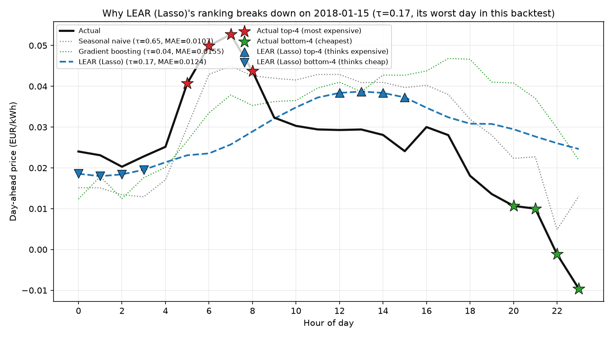
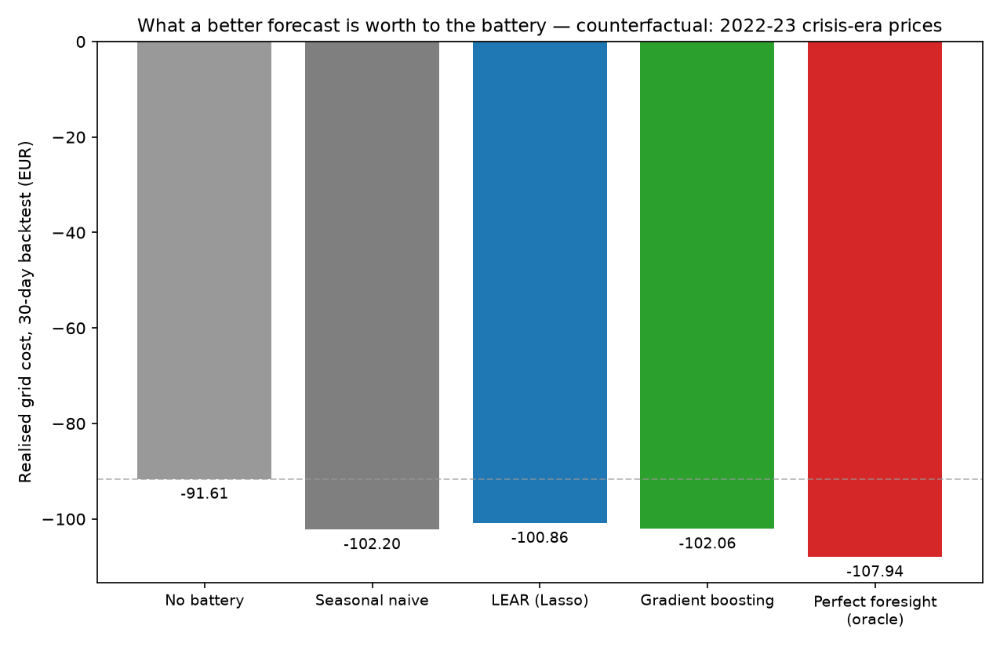

# Forecast-aware battery scheduling

An end-to-end, backtested extension of Gurobi's battery scheduling example. Instead of assuming next-day load and electricity prices are known, the pipeline forecasts them, turns the resulting uncertainty into scenarios, solves a risk-aware stochastic dispatch, and is graded on realised economic outcome (on synthetic data, on real German household and market data, and on a constructed real-price scenario), not on forecast error alone.

## Summary

This project asks a practical question: does better electricity-price forecasting actually produce better battery decisions? It's an end-to-end forecast → scenario → CVaR-stochastic-dispatch pipeline, evaluated by walk-forward backtesting on synthetic data and two real German market regimes.

The main result: forecast accuracy doesn't translate monotonically into economic value. In the real-data backtest, LEAR has the lowest price MAE but the worst battery economics; seasonal naive has the worst MAE but the best outcome. Aggregate rank-based metrics (Kendall's τ, extreme-hour recall) explain this reversal where MAE can't — but daily analysis shows no single metric reliably predicts one model's day-to-day value either.

So the finding is less "replace MAE with τ" than "forecast quality isn't one number for a storage decision": average error, overall ranking, and identification of price extremes are different, only partly overlapping things, and which matters most depends on the model, the regime, and the battery's own constraints. In the real-data backtest, a perfect-foresight oracle shows 75.5% of grid cost is theoretically avoidable — §4 measures how much of that a real forecaster actually captures.

**Key result — real German backtest (§4.1):**

| | MAE (EUR/kWh) | Kendall's τ | Top-4 expensive-hour recall | Realised cost, 30 days |
|---|---:|---:|---:|---:|
| Seasonal naive | 0.0138 | **0.565** | 0.42 | **€2.87** |
| Gradient boosting | 0.0091 | 0.550 | **0.45** | €3.59 |
| LEAR (Lasso) | **0.0089** | 0.452 | 0.12 | €4.53 |

The lowest-MAE model is the least profitable; the highest-MAE model is the most profitable.

## 1. Research questions

1. A few 2025–26 papers ([arXiv:2604.12082](https://arxiv.org/abs/2604.12082), [arXiv:2511.13616](https://arxiv.org/abs/2511.13616)) report that MAE tracks a forecast's economic value to battery arbitrage poorly, and that rank correlation tracks it better. Does that hold here — and more specifically, is there a single metric that reliably predicts battery value across models and forecast origins, or does the metric–value relationship depend on which model, which day, and which economic outcome you look at?
2. Does the MAE–economic-value disconnect from RQ1 persist under a structurally different price-volatility regime (a calm pre-2021 market vs. the 2022–23 European energy-crisis era), and does the relative usefulness of rank- and extreme-hour-based diagnostics change?

## 2. Methodology

### 2.1 Pipeline

```
history.csv ──▶ forecast (per candidate) ──▶ residual scenarios ──▶ CVaR stochastic LP ──▶ realised cost
 (load, PV,        seasonal-naive /            block-bootstrap of      behind-the-meter        vs. no-battery
  price, optional    direct multi-step          rolling-origin          balance, battery         baseline and
  residual load)      GB / LEAR                  validation errors      dynamics, CVaR risk       perfect-foresight
                                                                                                    oracle
```

1. **Forecasting** (`battery_schedule/forecast.py`). Three candidates: `seasonal_naive` (same hour last week), and two direct multi-step models — gradient boosting (sklearn `HistGradientBoostingRegressor`) and LEAR, a LASSO-regularized linear autoregression and one of the two reference models in the day-ahead electricity price forecasting benchmark of Lago et al. (2021), [epftoolbox](https://github.com/jeslago/epftoolbox). "Direct" means one model per horizon step (1..24h ahead), trained only on features knowable at the origin: calendar features plus autoregressive lags of 24h or more. A recursive version was tried first, feeding each step's own near-term prediction back in as a short lag; it compounded error across the horizon and was dropped (details in `ITERATION_LOG.md`). Price is also forecast using load, PV, and, where available, system-wide residual load (actual grid load minus wind and solar generation) as exogenous inputs. Each is trained against its own historical realised value and, at deployment time, receives a forecast of that same variable rather than its future realised value — mirroring the train-on-actual/deploy-on-forecast information constraint real electricity price models face when using TSO-published load and generation forecasts, though this repo forecasts those inputs itself rather than consuming a published TSO product.
2. **Model selection** (rolling-origin validation). Each candidate is scored by MAE on origins strictly before the decision point, so there's no leakage, and one model is selected for the single schedule that actually gets deployed "tomorrow." The backtest below skips this step deliberately — every candidate is evaluated on its own.
3. **Scenario generation** (`make_scenarios`). The selected model's out-of-sample residuals are block-bootstrapped into joint load/price scenario paths, which keeps their historical co-movement (a cold snap raising both, say) instead of sampling each hour and variable independently.
4. **Optimization** (`battery_schedule/optimise.py`). A two-stage stochastic linear program: charge/discharge/state-of-charge decisions are shared across all scenarios (non-anticipative, first stage), import/export/cost variables are scenario-specific (second stage). The objective is `(1 − w)·E[cost] + w·CVaR_α(cost)`, so the schedule is hedged against the worst 1−α scenarios rather than just optimal on average. Solved with SciPy/HiGHS, no commercial solver needed.
5. **Evaluation** (`pipeline._backtest`). A walk-forward backtest: at every origin, each configured candidate is forecast, scenario-sampled, and dispatched independently, then priced against what actually happened. Two reference points are computed alongside every candidate — a no-battery baseline (net metering only) and a perfect-foresight oracle (the same LP solved against the actual realised load and price as the only "scenario," with no forecasting involved).

### 2.2 Metrics

Forecast quality isn't one number. MAE measures point accuracy; Kendall's τ measures whether the relative ordering of cheap vs. expensive hours is preserved; extreme-hour recall measures something narrower still — whether the hours containing the most extreme realised prices, a simple proxy for the hours that may matter most for arbitrage, are correctly identified. §4.1 treats these as three different, only partly overlapping views of the same forecast, since which one best explains realised economic outcome turns out to depend on the model and the day, not to be settled by any one of them.

- **MAE** — mean absolute error of the point forecast against the realised value.
- **Kendall's τ** — for every pair of hours in a 24-hour forecast, whether the forecast and the realised outcome agree on which one was more expensive. τ is (agreeing pairs − disagreeing pairs) / total pairs: 1.0 means the forecast's relative ranking of cheap vs. expensive hours is exactly right, 0.0 means the ranking carries no information, regardless of how small the average error is.
- **Top-4/bottom-4 extreme-hour recall** — of the 4 actual most-expensive (or cheapest) hours in a 24-hour horizon, the share the forecast also places in its own predicted top-4 (or bottom-4). τ weighs all 276 hour-pairs in a day equally; this targets only the hours containing the most extreme realised prices — a proxy for decision relevance, not a claim about which hours the battery's own SOC-constrained schedule actually acts on — so it can separate models that τ can't.
- **Realised grid cost** — each candidate's schedule, priced against the actual realised load, price, and PV, not the forecast. The number that would show up on a real bill.
- **Gap to oracle / share of oracle value captured** — realised cost minus the perfect-foresight oracle's cost (or, as a share, 1 minus that gap over the baseline-to-oracle range), i.e. how much of the theoretically achievable value a forecaster leaves on the table vs. captures. Treated as the primary economic outcome in §4 alongside realised cost vs. baseline, since it's the number the research questions are actually about: not "is a battery worth it" but "how much of the available value does forecast quality let you capture."

## 3. Data

| | Load & PV | Price | System fundamentals |
|---|---|---|---|
| Synthetic (`configs/default.yaml`) | Formula-generated, 2025-dated, 120 days | Formula-generated, same series | — |
| Real German 2015–18 (`configs/real_de.yaml`) | [OPSD household dataset](https://data.open-power-system-data.org/household_data/), `residential4` (Konstanz, southern Germany), real meter data, Oct 2015–Feb 2018 | ENTSO-E day-ahead auction price, DE-AT-LU bidding zone, real | ENTSO-E actual system load and wind+solar generation, DE-AT-LU, real |
| Constructed scenario (`configs/counterfactual.yaml`) | Same household's real load/PV, Oct 2015 onward, positionally reindexed | ENTSO-E day-ahead price, DE-LU zone, Aug 2022–Mar 2023, real but not co-observed with the load column | not used |

This constructed scenario recombines two real, independently observed series — it isn't a causal counterfactual in the econometric sense (no identification argument for what this household's own load *would have been* under 2022–23 prices) and isn't a historical replay either: this household never saw 2022–23 prices, and its load/PV values were never actually co-observed with them. It holds the household load/PV pattern fixed while substituting a crisis-era price series in place of the historical one, to test whether §4.1's MAE-vs-τ disconnect is a property of that specific calm market era, or replicates once volatility is structurally different.

All three configs use the same three forecast candidates and the same walk-forward backtest (30 days for the two real datasets, 7 for the synthetic quick-start), so results are directly comparable.

## 4. Results

### 4.1 Real German market, 2015–18 (30-day backtest, Jan 6 – Feb 4, 2018)

| Candidate | Price MAE (EUR/kWh) | Kendall's τ | Top-4 expensive recall | Bottom-4 cheap recall | Realised cost, 30 days | vs. no-battery | Share of oracle value captured |
|---|---|---|---|---|---|---|---|
| Seasonal naive | 0.0138 | 0.565 (best) | 0.42 | 0.51 | 2.87 EUR (best) | −44.5% (best) | 59.0% (best) |
| Gradient boosting | 0.0091 | 0.550 | 0.45 (best) | 0.58 (best) | 3.59 EUR | −30.5% | 40.4% |
| LEAR (Lasso) | 0.0089 (best) | 0.452 (worst) | 0.12 (worst) | 0.57 | 4.53 EUR (worst) | −12.5% (worst) | 16.5% (worst) |

No-battery baseline: 5.17 EUR. Perfect-foresight oracle: 1.27 EUR, a 75.5% reduction vs. baseline.


MAE ranks the candidates backwards: LEAR has the best point accuracy and the worst realised profit of the three; naive has the worst MAE and the best profit. Aggregate τ gets the model ranking right instead (naive > GB > LEAR, matching realised profit) — an independent result consistent with what [arXiv:2604.12082](https://arxiv.org/abs/2604.12082) ("When Forecast Accuracy Fails") and [arXiv:2511.13616](https://arxiv.org/abs/2511.13616) report on other datasets, that rank correlation tracks realised battery dispatch value better than MAE or RMSE does.

τ weighs all 276 hour-pairs in a day equally, but a battery's dispatch decision mainly depends on a handful of them — splitting τ into top-4/bottom-4 extreme-hour recall reveals an asymmetry the aggregate number hides. LEAR identifies the four cheapest hours at roughly the same rate as GB and naive (0.57 vs. 0.58 and 0.51), but its recall of the four most expensive hours is only 0.12 vs. 0.42–0.45 for the other two: its weak τ isn't a uniform loss of ordering information, it's concentrated in missing price spikes, which is also where a battery's largest arbitrage opportunities are. Top-4 recall alone reproduces the three-model economic ordering more sharply than τ does, though that's a comparison of 3 model-level means, not a statistical claim — the next section checks whether it holds up day-to-day.

Every candidate here still leaves 1.6–3.3 EUR of the oracle's value on the table.

**Day-to-day robustness.** The clean three-model ordering above doesn't mean any metric reliably predicts day-to-day value. Using the per-day, per-candidate breakdown every backtest run records (`pipeline._backtest()`'s `daily` field; `python -m scripts.analyze_daily --metrics results/run_metrics_real_de.json`), pooled across 90 (day, candidate) observations, τ and top-4 recall have similar, modest correlations with oracle-relative performance, while MAE is comparably strong or stronger by one measure; bottom-4 recall — flat in the aggregate table above — is actually the strongest pooled correlate of savings vs. baseline:

| Daily diagnostic (pooled, n=90) | Correlation with economic outcome |
|---|---:|
| τ → −gap to oracle | r=+0.26 (p=0.014, Pearson) |
| MAE → −gap to oracle | r=−0.36 (p=0.001, Spearman) |
| Top-4 recall → −gap to oracle | r=+0.27 (p=0.010, Pearson) |
| Bottom-4 recall → savings vs. baseline | r=+0.32 (p=0.002, Pearson) |

Broken out per candidate (n=30 each), the leading metric changes again: gradient boosting's τ, MAE, and top-4 recall all track its own daily economics about equally (r≈0.4–0.5); naive's strongest daily relationship is with bottom-4 recall, not τ or MAE; LEAR's daily τ has essentially no relationship with its own daily economics (r≈0.03) even though its recall does — consistent with a persistent structural gap (missing spikes most days) rather than day-to-day noise. No metric is a universal daily predictor here; full breakdown in `results/run_metrics_real_de.json`. We stopped at this point rather than searching further specifications (other windows, lagged correlations, other targets) for one where a favoured metric "wins" — that would be fishing, not a result.

An earlier backtest window in the same dataset (Dec 2, 2017 – Jan 1, 2018, which includes New Year) produced net losses for two of the three candidates, before the forecaster was fixed to use direct multi-step forecasting and exogenous market fundamentals (§5, and `ITERATION_LOG.md`). It's included here for a sense of how much a specific 30-day window can matter, not as a second controlled result.

**Which hours actually break LEAR's ranking.** A scan of per-day τ across all 30 backtest origins (`scripts/diagnose_tau.py`, results in `results/tau_scan_lear.json`) finds LEAR's single worst day at Jan 15, 2018 (τ=0.17). Zooming into just that day:



On that day, the realised price exhibits a sharp early-morning spike followed by strongly negative late-evening prices, a shape that differs substantially from the smoother pattern LEAR's forecast follows. None of LEAR's own top-4 predicted-expensive hours or bottom-4 predicted-cheap hours overlaps with the corresponding realised-extreme-hour sets. Seasonal naive, simply repeating the previous week's same-hour prices, happens to track this day's shape better (τ=0.65). Gradient boosting performs even worse on this particular day (τ=0.04), so the observation isn't a LEAR-only failure.

This day is best read as a regime/outlier diagnostic, not as an explanation of LEAR's aggregate ranking weakness — one bad day shouldn't be allowed to carry that claim on its own, and it's a clean illustration of the mechanism above rather than a separate one: none of LEAR's own predicted-expensive hours land on an actual expensive hour, the same asymmetric, expensive-hour-blind failure the 30-day aggregate top-4 recall (0.12) points to. Checked directly, excluding Jan 15 changes any model's aggregate MAE, τ, extreme-hour recall, realised cost, or oracle-capture share by at most a point or two (`python -m scripts.analyze_daily --exclude-date 2018-01-15`) — LEAR's top-4 recall is unchanged at 0.12 — so nothing in §4.1's table is being driven by this one day.

### 4.2 Constructed scenario: does the MAE-vs-τ disconnect hold under a different volatility regime?

German day-ahead prices in 2015–18 were unusually calm — this dataset's price standard deviation is 0.015 EUR/kWh. The 2022 European gas crisis, plus higher renewable penetration since, raised both the level and the volatility of prices structurally; this constructed scenario's price std is 0.161 EUR/kWh, roughly an order of magnitude higher. This isn't a test of whether thin price spreads explain poor profitability — §4.1's oracle already shows 75% of cost was theoretically avoidable even in the calm market, so the main remaining gap in that experiment isn't the absence of theoretical arbitrage value, it's the ability of the forecast-driven dispatch to capture it. It's a test of whether §4.1's finding survives a structurally different regime.

| Candidate | Price MAE (EUR/kWh) | Kendall's τ | Share of oracle value captured |
|---|---|---|---|
| Seasonal naive | 0.0341 | 0.536 (best) | 64.8% (best) |
| Gradient boosting | 0.0302 (best) | 0.518 | 64.0% |
| LEAR (Lasso) | 0.0376 (worst) | 0.040 (collapsed) | 56.6% (worst) |




With the thicker spread, every candidate is profitable, unlike some of them in §4.1's earlier window. LEAR's MAE is only a little worse than the other two here, but its τ drops to 0.04 — close to zero, indicating little useful rank information (not a formal significance claim; that would need a permutation test against the null distribution for a 24-observation daily ranking). A linear model that ranks calm, mean-reverting prices tolerably well (τ 0.45–0.52 in §4.1) falls apart on the sharp, nonlinear spikes of a crisis-era market — a failure that MAE alone never shows.

### 4.3 Synthetic data (sanity check only)

| Candidate | Price MAE (EUR/kWh) | Kendall's τ | Realised cost, 7 days | vs. no-battery |
|---|---|---|---|---|
| Seasonal naive | 0.0129 | 0.621 | 26.36 EUR | −34.9% |
| Gradient boosting | 0.0100 (best) | 0.636 | 26.17 EUR (best) | −35.3% (best) |
| LEAR (Lasso) | 0.0252 | 0.655 (best) | 27.00 EUR | −33.3% |

Baseline 40.47 EUR, oracle 25.64 EUR (−36.6%). All three land within a few percent of each other, and the best-MAE and best-τ candidates aren't even the same one — synthetic data (a smooth curve plus noise) just doesn't have enough real structure for MAE and τ to pull apart the way they do on real data. Read this section only as "the pipeline runs end to end," not as evidence either way for the findings above.

### 4.4 Risk-aversion (CVaR) sensitivity

Re-run with the current forecaster and the current backtest window (gradient boosting, `configs/real_de.yaml`, the same Jan 6 – Feb 4, 2018 window as §4.1; `results/cvar_sensitivity_real_de.json`). An earlier version of this sweep, run before the forecaster fix (§2.1, `ITERATION_LOG.md`), is no longer representative and has been replaced.


With the current forecaster, the battery is profitable at every CVaR weight tested (−30.5% to −35.4% vs. baseline) — risk-aversion is no longer the difference between profit and loss, the way it was in the earlier, pre-fix version of this sweep; here it's a smaller lever on top of an already-profitable schedule. The relationship isn't monotonic: weight=0.2 (the default used elsewhere in this README) is actually slightly worse than weight=0 (−30.5% vs. −32.6%), improves through 0.5 and 0.8 (−35.4%, the best setting found), and eases off slightly at the pure-worst-case extreme, weight=1 (−34.6%). That maximal risk-aversion isn't the best setting still holds; the earlier "risk-aversion turns a loss into a smaller loss" framing doesn't, now that the underlying forecaster and price spread support a profitable schedule regardless.

## 5. Discussion

**Question 1.** No single metric answers this reliably — that instability is itself the main finding, not a nuisance to explain away. §4.1's three layers of evidence (cross-model aggregate, daily pooled, within-candidate) each show something different, and the layer that looks cleanest — aggregate τ and top-4 recall correctly ordering the three models — doesn't hold up as a day-to-day predictor for any single model. What ties the layers together is a mechanism, not a winning metric: LEAR's failure is concentrated specifically in missing price spikes (§4.1's asymmetric recall), and that same asymmetry gets more severe under higher volatility (§4.2, τ collapses to ~0.04). Forecast accuracy isn't a scalar quantity for a storage decision — MAE, τ, and extreme-hour recall measure genuinely different things, and which one matters most for a given day or model depends on where the forecast's errors fall in the price distribution and how they interact with the battery's own sequential constraints, not on any one metric being the "right" one. What this repo adds beyond the literature cited in §4.1 is this layered picture, rather than only confirming that rank-based metrics beat MAE in aggregate.

**Question 2.** It persists, and gets more severe: LEAR's τ drops from 0.452 in the calm 2015–18 window to 0.04 in the high-volatility constructed scenario (§4.2), plausibly reflecting a linear model's limited ability to capture the nonlinear, spike-driven structure of electricity prices as volatility rises. The oracle indicates substantial theoretical arbitrage value in *both* regimes — 75.5% of cost avoidable even in the calm window (§4.1) — so regime changes less how much value is theoretically available than how easily forecast-driven dispatch captures it: an early, pre-fix version of this backtest still lost money in the calm window despite that available value, because the forecaster itself was broken (§2.1, `ITERATION_LOG.md`), not because the market lacked arbitrage opportunity. The high-volatility scenario, by contrast, made every candidate profitable regardless of forecast quality; the two models with moderate τ captured about 64% of oracle value there against LEAR's 56.6% (§4.2), consistent with rank information mattering, though a 3-model comparison doesn't establish causality. Seasonal naive was itself regime-dependent — best performer in the calm, holiday-free §4.1 window, worst in an earlier window that included New Year — so "naive is a strong baseline" isn't a fixed property of the model.

## 6. Limitations

- Two or three 30-day backtest windows per regime is a small sample; findings here are empirical diagnostics, not statistically generalised benchmark results.
- §4.1's observation that top-4 recall's *aggregate* ordering lines up with the economic ranking more sharply than τ's is a comparison of 3 model-level means (naive/GB/LEAR), not a statistically established claim that recall generally outpredicts τ. Checked at the daily level (n=90 pooled, n=30 per candidate) it doesn't hold up cleanly either — top-4 recall's pooled correlation with economic value is about the same size as τ's, and bottom-4 recall (flat in aggregate) has the strongest pooled correlation of the four metrics tested against one of the two economic targets. All of these daily-level numbers are diagnostic, not hypothesis tests.
- §4.2's constructed scenario recombines two real, independently observed series and doesn't claim this household experienced 2022–23 prices, or support a causal reading (no identification argument for what this household's load would have been under those prices).
- Whether residual load as an exogenous price driver (§2.1) actually helps, net of everything else, isn't cleanly isolated yet — the two real-data windows in §4.1 differ in both the forecaster and the backtest period at once. A same-window ablation is the natural next step (`ITERATION_LOG.md`).
- No decision-focused learning (training the forecaster's loss to directly minimize downstream battery regret, [arXiv:2305.00362](https://arxiv.org/abs/2305.00362)) and no conformal-prediction-calibrated risk control ([arXiv:2501.08472](https://arxiv.org/abs/2501.08472)) here. Both are reasonable next steps this repo hasn't taken.

## 7. Reproducing this

### Synthetic quick start (no API keys needed)

```bash
python -m venv .venv && source .venv/bin/activate
pip install -e '.[dev]'
battery-schedule make-demo-data --output data/raw/history.csv
battery-schedule run --config configs/default.yaml
pytest
python scripts/plot_results.py --config configs/default.yaml --suffix synthetic
python scripts/plot_forecast_value.py --metrics artifacts/run_metrics.json --suffix synthetic
```

### Real German data (§4.1)

```bash
pip install -e '.[research]'   # entsoe-py
curl -o data/raw/opsd_household_60min.csv https://data.open-power-system-data.org/household_data/2020-04-15/household_data_60min_singleindex.csv
echo "ENTSOE_API_KEY=..." > .env   # https://transparency.entsoe.eu/ -> "Web API Security Token"
python -m scripts.prepare_real_data
battery-schedule run --config configs/real_de.yaml   # ~60-90 min: every candidate is refit at every backtest origin
python -m scripts.plot_forecast_value --metrics artifacts_real/run_metrics.json --suffix real
```

### Constructed scenario (§4.2)

```bash
python -m scripts.prepare_counterfactual_data
battery-schedule run --config configs/counterfactual.yaml
python -m scripts.plot_forecast_value --metrics artifacts_counterfactual/run_metrics.json --suffix counterfactual --title-suffix " — constructed scenario: 2022-23 crisis-era prices"
```

`battery-schedule run` prints one line per backtest day. A 30-day real-data run takes roughly 60–90 minutes, since every candidate is independently refit — rolling-origin validation plus a final refit — at every origin (§2.1).

## 8. Input contract

CSV must contain `timestamp` (timezone-aware or UTC), `load_kw`, and `import_price_eur_kwh`. It may contain `pv_kw`, `export_price_eur_kwh`, and `residual_load_mw`. Rows must be hourly, regular, and have no duplicate timestamps — see `battery_schedule.data.read_history`. Day-ahead prices may be negative, a real feature of high-renewables markets, and aren't clipped; load and PV must be non-negative.

## 9. Project structure

```
src/battery_schedule/                   production pipeline — tested, CI-covered
  forecast.py                             seasonal_naive / gradient_boosting / lear, direct multi-step,
                                           residual-load-aware price forecasting
  optimise.py                             CVaR two-stage stochastic LP
  pipeline.py                             run() for the deployable next-day schedule;
                                           _backtest() for the per-candidate + oracle evaluation in §2.1/§4
configs/default.yaml                    synthetic quick-start config
configs/real_de.yaml                    real German household + ENTSO-E config (§4.1)
configs/counterfactual.yaml             constructed scenario: same household's load pattern + 2022-23 crisis-era prices (§4.2)
scripts/entsoe_client.py                ENTSO-E price / load / generation connectors
scripts/prepare_real_data.py            builds data/raw/history_de_real.csv from OPSD + ENTSO-E
scripts/prepare_counterfactual_data.py  builds the constructed-scenario CSV (real load pattern + recombined price series)
scripts/plot_results.py                 the day-ahead dispatch chart from a completed run
scripts/plot_forecast_value.py          the per-candidate value/MAE/tau charts in §4, reads run_metrics.json
scripts/cvar_sensitivity.py             realised cost across a CVaR-weight sweep, for one named candidate
scripts/diagnose_tau.py                 per-day tau for one candidate, to find which specific hours it misranks
scripts/plot_diagnostic_day.py          actual-vs-forecast chart for one backtest day, with top-4/bottom-4 hours marked
scripts/analyze_daily.py                daily tau/MAE/recall-vs-economics correlations and leave-one-day-out checks, from pipeline._backtest()'s daily[] field
scripts/plot_cvar_sensitivity.py        the CVaR-weight sweep chart in §4.4, reads cvar_sensitivity.py's output
results/                                committed copies of expensive-to-recompute outputs — see results/README.md
tests/                                  end-to-end pytest: forecast → scenarios → schedule,
                                         plus a net-exporter-day regression test
ITERATION_LOG.md                        the chronological debugging/decision history behind this README
```

A container recipe (`Dockerfile`) and GitHub Actions CI are included.
