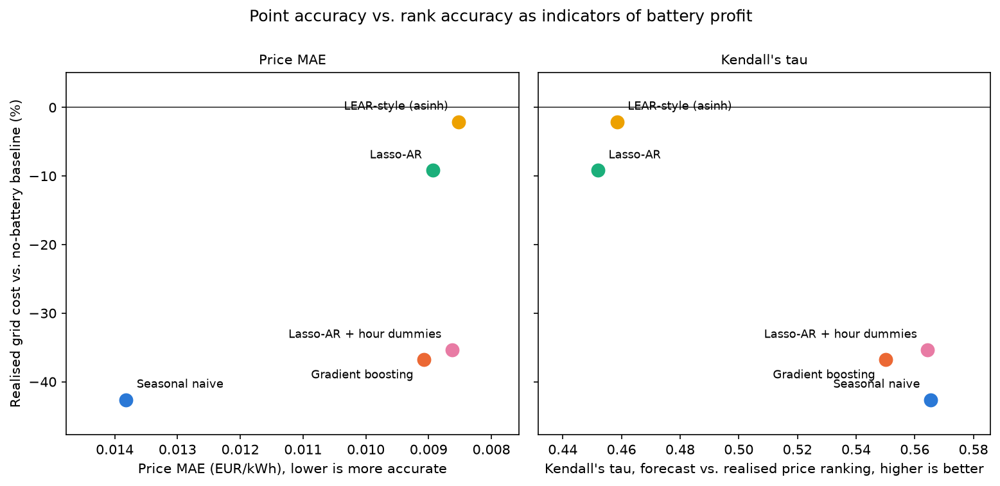
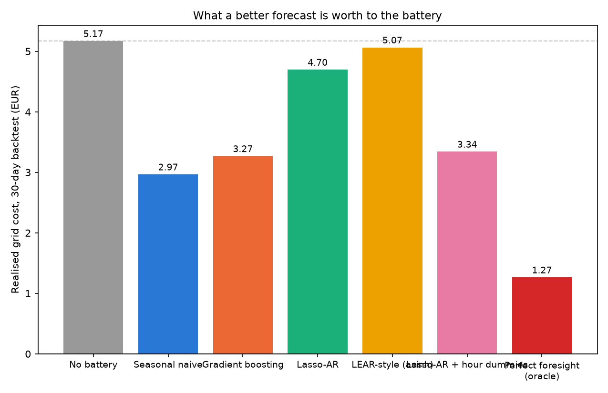
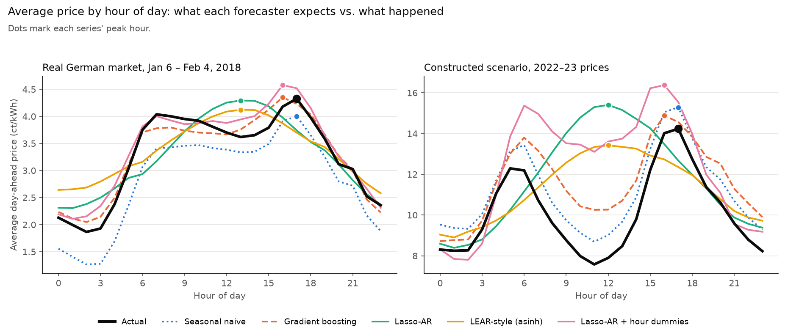
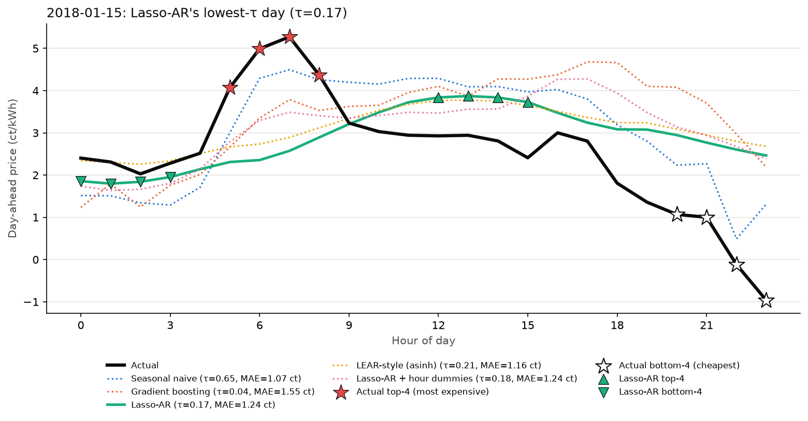
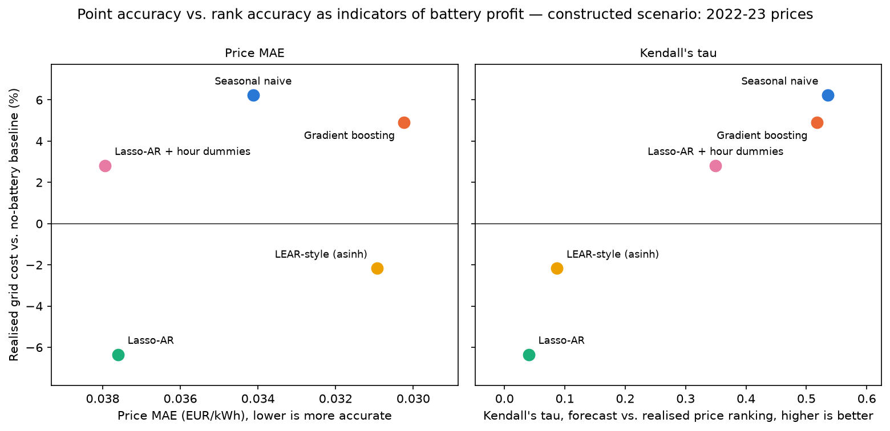
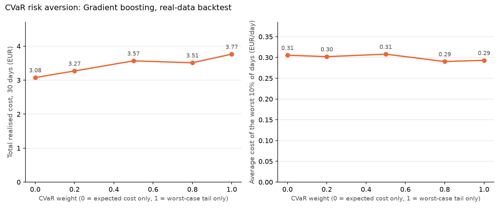

# Companion study: a household battery on real 2015–18 German data

The main [README](../README.md) covers a market-scale merchant battery across three countries
and six years. This is the study that came first: a much smaller, household-scale battery
(13.5 kWh / 5 kW) behind a real German meter, backtested on 30 days of real market data plus a
constructed high-volatility scenario. It uses the same forecast → scenario → CVaR-stochastic-LP
pipeline and the same evaluation discipline, and it is where the CVaR/scenario layer (§4) and the
value-of-modelling-uncertainty split were actually tested — something the market-scale study does
not repeat, because it runs the deterministic (point-forecast) pipeline only, for compute reasons
(see the main README's Methodology).

Numbers in this document supersede those in earlier commits; `ITERATION_LOG.md` §15 lists what
changed and why.

## 1. Methodology

### 1.1 Pipeline

```
history.csv ──▶ forecast (per candidate) ──▶ residual scenarios ──▶ CVaR stochastic LP ──▶ realised cost
 (load, PV,        five candidates             block-bootstrap of      behind-the-meter        vs. no-battery
  price, optional  (§1.2)                      validation errors       balance, battery         baseline and
  residual load)                                                       dynamics, CVaR risk      perfect-foresight oracle
```

1. **Forecasting** (`battery_schedule/forecast.py`). Direct multi-step forecasts: one model per horizon step (1..24h), trained only on features known at the origin (calendar features and lags of 24h or more). A recursive version was tried first; it compounded error across the horizon and was dropped (`ITERATION_LOG.md`). Price also uses load, PV and, where available, system-wide residual load (actual grid load minus wind and solar generation) as exogenous inputs. Each exogenous input is trained on its own realised history and, at forecast time, is replaced by a forecast of itself, which mirrors the information constraint of models that use TSO-published forecasts (this repo forecasts those inputs itself). Price forecasts and scenarios are not clipped at zero, because German day-ahead prices go negative; only load is.
2. **Scenario generation** (`make_scenarios`). The forecast model's out-of-sample residuals over the last 14 days are block-bootstrapped (4-hour blocks) into joint load/price paths, which keeps their co-movement.
3. **Optimization** (`battery_schedule/optimise.py`). A two-stage stochastic linear program: charge, discharge and state of charge are shared by all scenarios (first stage); grid import, export and cost are scenario-specific (second stage). The objective is `(1 − w)·E[cost] + w·CVaR_α(cost)` with w = 0.2 and α = 0.9. Each scenario exports at 0.75 × its own price path. Solved with SciPy/HiGHS.
4. **Evaluation** (`pipeline._backtest`). At every origin each candidate is forecast, planned and only then priced against what happened. `_plan()` takes only the training history and the candidate's forecast, so the schedule cannot see the day it is priced on: PV is a seasonal-persistence forecast and export prices are 0.75 × the forecast price. A test distorts every realised value on the final day and checks that the schedule does not move. Three schedules are built per candidate and day: the CVaR schedule, a risk-neutral scenario schedule (w = 0) and a deterministic schedule from the point forecast alone. A no-battery baseline and a perfect-foresight oracle (the same LP on the realised values) are computed per day.
5. **Model selection** happens only in `run()`, which must commit to one schedule for tomorrow (by validation MAE). The backtest skips it: every candidate is evaluated on its own.

### 1.2 Forecast candidates

| Candidate | What it is |
|---|---|
| Seasonal naive | Same hour last week. No parameters, no exogenous inputs. |
| Gradient boosting | scikit-learn `HistGradientBoostingRegressor`, direct multi-step. |
| Lasso-AR | LASSO-regularized linear autoregression on raw prices. Calendar features are one sin/cos pair per cycle (first harmonic of hour of day and of day of week). |
| LEAR-style (asinh) | Lasso-AR with the asinh variance-stabilizing price transform (median/MAD scaling) used in the LEAR benchmark of Lago et al. ([epftoolbox](https://github.com/jeslago/epftoolbox)). It is not the full LEAR: one 120-day calibration window rather than an ensemble of windows. |
| Lasso-AR + hour dummies | Lasso-AR plus 24 hour-of-day dummies. The only change from Lasso-AR. |

The last three form two controlled comparisons against Lasso-AR: one change each (asinh transform; hour dummies).

### 1.3 Metrics

Forecast quality is not one number, so three views of a forecast are reported.

- **MAE**: mean absolute price error.
- **Kendall's τ**: over the 276 pairs of hours in a day, the share the forecast orders correctly minus the share it orders wrongly.
- **Top-4 / bottom-4 recall**: of the 4 hours with the highest (lowest) realised prices, the share the forecast also puts in its own top (bottom) 4. A proxy for the hours arbitrage cares about, not a claim about which hours the SOC-constrained schedule acts on. §2.5 checks other values of k.

Economic outcomes: **realised cost** (import cost minus export revenue, priced on actuals), **battery value** (baseline cost minus realised cost) and **share of oracle value** (battery value divided by the oracle's).

### 1.4 Statistical treatment

Every number comes from 30 backtest days, and days are serially correlated, so intervals use a circular moving-block bootstrap (5-day blocks, 5000 resamples) that resamples whole days. Correlations between a metric and cost are reported two ways. Pooled, they mix in how hard the day was for every model: volatile days raise both MAE and the gap to the oracle. Day-demeaned (each metric and each gap minus that day's average across candidates), they ask whether, on the same day, the candidate with the better metric cost less. Model-level rank correlations have n = 5 and are descriptive. `scripts/robustness.py` produces all of this from the stored per-day records.

## 2. Data

| | Load & PV | Price | System fundamentals |
|---|---|---|---|
| Synthetic (`configs/default.yaml`) | Formula-generated, 120 days | Formula-generated | none |
| Real German 2015–18 (`configs/real_de.yaml`) | [OPSD household dataset](https://data.open-power-system-data.org/household_data/), `residential4` (Konstanz), real meter data, Oct 2015–Feb 2018 | ENTSO-E day-ahead price, DE-AT-LU zone | ENTSO-E actual system load and wind + solar generation, DE-AT-LU |
| Constructed scenario (`configs/counterfactual.yaml`) | Same household's real load/PV, positionally reindexed | ENTSO-E day-ahead price, DE-LU zone, Aug 2022–Mar 2023 | none |

The constructed scenario recombines two real series. It is not a causal counterfactual (no argument for what this household's load would have been under 2022–23 prices) and not a historical replay: the household never saw those prices. It keeps the household's load/PV pattern and swaps in a crisis-era price series, to test whether the findings from the calm window survive a very different regime. The battery is 13.5 kWh / 5 kW, and the import price is the wholesale day-ahead price (no network charges or taxes).

All configs use the same five candidates and the same walk-forward backtest (30 days for the real datasets, 7 for the synthetic quick start).

## 3. Results

### 3.1 Real German market, 2015–18 (30-day backtest, Jan 6 – Feb 4, 2018)

| Candidate | Price MAE (EUR/kWh) | Kendall's τ | Top-4 expensive recall | Bottom-4 cheap recall | Realised cost (EUR) | Battery value (EUR) | Share of oracle value |
|---|---:|---:|---:|---:|---:|---:|---:|
| Seasonal naive | 0.0138 | 0.565 | 0.42 | 0.51 | 2.97 | +2.20 | 56.4% |
| Gradient boosting | 0.0091 | 0.550 | 0.45 | 0.58 | 3.27 | +1.90 | 48.7% |
| Lasso-AR | 0.0089 | 0.452 | 0.12 | 0.57 | 4.70 | +0.48 | 12.2% |
| LEAR-style (asinh) | 0.0085 | 0.458 | 0.12 | 0.55 | 5.07 | +0.11 | 2.8% |
| Lasso-AR + hour dummies | 0.0086 | 0.564 | 0.49 | 0.62 | 3.34 | +1.83 | 46.8% |

No-battery baseline 5.17 EUR; perfect-foresight oracle 1.27 EUR (a 75.5% reduction, so 3.91 EUR of value is available).




**Across models.** MAE ranks the five models nearly backwards: the Spearman correlation between −MAE and −cost is −0.90. Kendall's τ gives +0.80 and top-4 recall +0.56 (n = 5, descriptive). These match the direction reported in two 2025–26 papers ([arXiv:2604.12082](https://arxiv.org/abs/2604.12082), [arXiv:2511.13616](https://arxiv.org/abs/2511.13616)), on a different dataset and pipeline.

**How sure is the cost ranking?** Paired daily cost differences (EUR/day, negative = first is cheaper, 95% block-bootstrap CI):

| Pair | Difference | 95% CI |
|---|---:|---|
| Seasonal naive − Gradient boosting | −0.010 | [−0.034, +0.012] |
| Seasonal naive − Lasso-AR + hour dummies | −0.013 | [−0.045, +0.025] |
| Gradient boosting − Lasso-AR + hour dummies | −0.003 | [−0.020, +0.020] |
| Gradient boosting − Lasso-AR | −0.048 | [−0.065, −0.031] |
| Seasonal naive − Lasso-AR | −0.058 | [−0.091, −0.024] |
| Lasso-AR − Lasso-AR + hour dummies | +0.045 | [+0.027, +0.063] |
| Lasso-AR − LEAR-style (asinh) | −0.012 | [−0.028, −0.002] |

Over 30 days there are two tiers. Seasonal naive, gradient boosting and the hour-dummy model cannot be told apart. Lasso-AR and the asinh variant are clearly worse than all three. Seasonal naive is not shown to beat gradient boosting.

**Day by day.** Pooled over all day × candidate observations, τ, −MAE and top-4 recall correlate with −(gap to oracle) about equally (r ≈ +0.31 to +0.32), and the differences between them are indistinguishable from zero. Pooling is confounded by day difficulty. Comparing models on the same day:

| Metric vs. −gap to oracle, day-demeaned | r | 95% CI |
|---|---:|---|
| Kendall's τ | +0.40 | [+0.24, +0.55] |
| Top-4 expensive recall | +0.46 | [+0.32, +0.58] |
| −MAE | +0.18 | [+0.00, +0.31] |

Top-4 recall's advantage over MAE is +0.28 (CI [+0.06, +0.52]); τ's is +0.23 (CI [−0.01, +0.49]). On the same day, the candidate with the better ranking cost less, and MAE says much less. This is a within-day, across-model comparison with four to five candidates per day, so it supports "rank metrics track cost better than MAE here" and nothing stronger.

### 3.2 Why the plain Lasso models fail



The real peak hour is 16–18h on 18 of the 30 days and 6–8h on 11; it is never at midday. Lasso-AR puts its predicted peak in 12–14h on 26 days and never at 6–8h; the asinh variant does so on 25 days. The hour-dummy model puts it at 16–18h on all 30. The cause is the calendar block: a single sin/cos pair per horizon step is one sinusoid, which cannot produce a morning-and-evening double peak.

| | Lasso-AR | + asinh transform | + hour dummies |
|---|---:|---:|---:|
| Top-4 expensive recall | 0.12 | 0.12 | 0.49 |
| Kendall's τ | 0.452 | 0.458 | 0.564 |
| Realised cost (EUR) | 4.70 | 5.07 | 3.34 |
| Within-day price std of the forecast (ct/kWh; actual 0.93) | 0.73 | 0.55 | 0.81 |
| Energy charged per day (kWh) | 0.9 | 0.3 | 3.0 |

The asinh transform, which I first suspected, does not help: recall is unchanged and the forecast is flatter and slightly worse (paired cost difference above). The hour dummies restore the double-peak structure. A forecast that flattens the day also barely trades: the LP only cycles when the predicted spread beats the 0.01 EUR/kWh degradation cost plus round-trip losses, and in this calm market spreads are only a few cents. This also explains why seasonal naive, whose forecast is over-dispersed (std 1.11 ct/kWh) and charges 5.1 kWh a day, is not beaten by the hour-dummy model even though the latter matches its τ and has the better top-4 recall. Forecast quality for a storage decision includes the size of the spread as well as the ordering.

The lowest-τ day for Lasso-AR is Jan 15, 2018. The real price spikes at 5–8h and falls below zero at night; every learned model predicts the usual evening peak, and the hour-dummy model does no better that day (τ = 0.18 vs. 0.17). Only seasonal naive gets the shape (τ = 0.65). The day is unusual for everyone, so it illustrates the failure but does not show that the fix works on every day.



### 3.3 Constructed scenario: 2022–23 prices on the same household

Price standard deviation is 0.161 EUR/kWh here vs. 0.015 in the calm window. The household is a net exporter in this window, so the baseline is a net earnings of 91.61 EUR and the oracle reaches 107.94 EUR (16.33 EUR of value).

| Candidate | Price MAE (EUR/kWh) | Kendall's τ | Top-4 expensive recall | Realised cost (EUR) | Battery value (EUR) | Share of oracle value |
|---|---:|---:|---:|---:|---:|---:|
| Seasonal naive | 0.0341 | 0.536 | 0.70 | −97.32 | +5.70 | 34.9% |
| Gradient boosting | 0.0302 | 0.518 | 0.67 | −96.11 | +4.50 | 27.6% |
| Lasso-AR | 0.0376 | 0.040 | 0.05 | −85.80 | −5.81 | −35.6% |
| LEAR-style (asinh) | 0.0309 | 0.087 | 0.14 | −89.62 | −1.99 | −12.2% |
| Lasso-AR + hour dummies | 0.0379 | 0.349 | 0.49 | −94.19 | +2.58 | 15.8% |



The pattern from §3.1 holds and is sharper. Two of five forecasters lose money against having no battery. Across models, the Spearman correlation with cost is +1.00 for τ, +1.00 for top-4 recall and +0.30 for −MAE. On the same day, τ has a day-demeaned correlation of +0.74 (CI [+0.69, +0.78]) and top-4 recall +0.67 ([+0.60, +0.75]) against +0.14 for −MAE ([−0.03, +0.37]); the advantage over MAE is +0.59 for τ (CI [+0.38, +0.76]) and +0.53 for top-4 recall ([+0.33, +0.72]). Adding hour dummies to Lasso-AR raises τ from 0.04 to 0.35 and turns a 5.81 EUR loss into a 2.58 EUR gain (paired difference +0.28 EUR/day, CI [+0.19, +0.39]). Here every model trades a lot (5–13 kWh charged per day), so the loss comes from charging and discharging at the wrong hours rather than from not trading.

### 3.4 What the stochastic layer adds

The scenario/CVaR layer is two separate choices, so it is split: (a) the value of modelling uncertainty at all (deterministic point-forecast schedule minus the risk-neutral scenario schedule) and (b) the effect of CVaR risk aversion on top (risk-neutral minus w = 0.2). Positive means realised cost fell. Mean EUR/day over the real-data window, 95% CI:

| Candidate | (a) modelling uncertainty | (b) CVaR, w = 0.2 |
|---|---|---|
| Seasonal naive | +0.003 [−0.005, +0.010] | −0.006 [−0.019, +0.006] |
| Gradient boosting | −0.002 [−0.015, +0.011] | −0.007 [−0.018, +0.003] |
| Lasso-AR | +0.003 [−0.003, +0.010] | −0.002 [−0.006, +0.000] |
| LEAR-style (asinh) | +0.003 [−0.001, +0.008] | −0.006 [−0.013, −0.001] |
| Lasso-AR + hour dummies | +0.005 [−0.006, +0.016] | −0.006 [−0.009, −0.002] |

In the calm window the scenario layer is worth nothing measurable, and CVaR at w = 0.2 costs about 0.002–0.007 EUR/day (a few percent of cost), which is what risk aversion should cost on average. Whether it earns that back in the worst days is what the sweep below examines. In the constructed scenario the picture is mixed: the risk-neutral scenario schedule is no better than the point forecast for most candidates (and worse for the asinh variant, −0.058 EUR/day, CI [−0.101, −0.018]), and CVaR again has a negative estimate for four of five candidates (three of them with intervals below zero).

**CVaR weight sweep** (gradient boosting, real-data window; `results/household/cvar_sensitivity_real_de.json`).



| CVaR weight | Total cost (EUR) | Worst day (EUR) | Mean of the worst 3 days (EUR/day) |
|---|---:|---:|---:|
| 0 | 3.08 | 0.436 | 0.305 |
| 0.2 (default) | 3.27 | 0.427 | 0.302 |
| 0.5 | 3.57 | 0.385 | 0.308 |
| 0.8 | 3.51 | 0.353 | 0.290 |
| 1 | 3.77 | 0.338 | 0.293 |

Going from weight 0 to 1 raises total cost by 0.69 EUR (22%) and lowers the single worst day by 0.10 EUR (22%), while the average of the three worst days moves by 0.01 EUR. In this calm window, where the worst day costs less than half a euro, CVaR buys little tail protection for what it costs. The battery is profitable at every weight (27% to 40% below the no-battery cost). The sweep covers one candidate over 30 days and says little about a market where the tail days are far more expensive (§3.3).

### 3.5 Other checks

**Household load and PV as price inputs.** With residual load available, are the household's own load and PV still useful as price features? The same backtest without them (`configs/real_de_no_household_exog.yaml`) changes cost by at most 0.004 EUR/day for any candidate (seasonal naive is unaffected by construction). The paired 95% intervals include zero for all but the hour-dummy model, which is 0.002 EUR/day cheaper without them (CI [+0.0004, +0.0039]). The household features add nothing measurable here, and the honest summary is "no detectable effect".

**Choice of k.** Top-k recall for the real window across k = 2..6: hour-dummy model 0.47, 0.47, 0.49, 0.49, 0.49; Lasso-AR 0.02, 0.06, 0.12, 0.19, 0.29; seasonal naive 0.35 to 0.52; gradient boosting 0.28 to 0.49. Lasso-AR and the asinh variant are last at every k; the order among the other three changes with k (the hour-dummy model leads up to k = 4, seasonal naive at k = 5 and 6). The battery's full-power duration is 13.5 / 5 = 2.7 hours, so k = 3 is the natural value; k = 4 in the tables is a convention.

**Synthetic data (sanity check only).** Seven days of formula-generated data (baseline 40.47 EUR, oracle 25.64 EUR):

| Candidate | Price MAE (EUR/kWh) | Kendall's τ | Top-4 expensive recall | Realised cost (EUR) | Battery value (EUR) | Share of oracle value |
|---|---:|---:|---:|---:|---:|---:|
| Seasonal naive | 0.0129 | 0.621 | 0.86 | 26.86 | +13.61 | 91.8% |
| Gradient boosting | 0.0100 | 0.636 | 0.86 | 26.33 | +14.14 | 95.4% |
| Lasso-AR | 0.0252 | 0.655 | 0.93 | 27.73 | +12.75 | 86.0% |
| LEAR-style (asinh) | 0.0236 | 0.652 | 0.79 | 28.10 | +12.38 | 83.4% |
| Lasso-AR + hour dummies | 0.0105 | 0.677 | 0.86 | 26.31 | +14.16 | 95.5% |

Here MAE and cost agree: the two Lasso variants without hour dummies have more than twice the MAE of the others and the highest cost, and the dummies cut Lasso-AR's MAE from 0.0252 to 0.0105, because the synthetic price is a smooth evening bump that a one-harmonic model misses even in level. Seven days of smooth data check that the pipeline runs end to end. They are not evidence about the questions above.

## 4. Discussion

MAE does not indicate which forecaster is worth more to the battery, and rank-based measures do better, in agreement with the papers cited. In the real window MAE orders the five models almost backwards (ρ = −0.90) and the two lowest-MAE models earn the least. τ and top-4 recall follow cost across models and, comparing models on the same day, explain cost differences better than MAE does (clearly in the volatile scenario, modestly in the calm window).

Three qualifications apply. First, pooled daily correlations do not separate the metrics, because day difficulty drives all of them; the same-day comparison is the fair test, and it rests on 30 days and five candidates. Second, neither τ nor top-4 recall is a complete summary: the hour-dummy model matches seasonal naive on τ and beats it on top-4 recall, yet costs slightly more (not significantly), because naive's forecast is more spread out and it trades more. When spreads are close to the degradation cost, forecast amplitude matters as well as ordering. Third, the useful result here is a diagnosis that the aggregate error could not give. The plain Lasso models had the lowest MAE and the worst economics, and looking at which hours they miss showed a feature-design limit (one sin/cos pair, so one midday hump) rather than a limit of linear models: a single added set of hour dummies fixes most of it — a mechanism the market-scale study (main README) revisits with target-aligned lags as a second, independent piece of calendar information.

The disconnect persists and is larger in the volatile scenario. There, two forecasters lose money against no battery, MAE has almost no link with cost across models (ρ = +0.30) while τ and top-4 recall order them perfectly (ρ = +1.00), and the same-day advantage of the rank measures over MAE is clear. The stochastic layer, in contrast, did not earn its keep in either regime as configured (§3.4), so improvements in this pipeline come from the forecast rather than from the scenario machinery.

## 5. Limitations

- Two 30-day windows and five forecasters are a small sample. Model-level rank correlations have n = 5. Intervals here are block-bootstrap intervals on daily data and are descriptive, not a formal test; a published forecasting benchmark would use much longer out-of-sample periods and tests such as Diebold–Mariano. The main README's market-scale study addresses this with three markets and six-plus years.
- The constructed scenario recombines two real series and supports no causal reading. It is one household load pattern.
- The model is a price-taker household battery with the wholesale price as import price (no network charges or taxes) and an export price fixed at 0.75 × the market price. Results for a utility-scale market participant would differ in level (see the main README).
- PV is forecast by seasonal persistence, and the scenarios use 30 bootstrapped residual paths from 14 days of validation errors. A better PV forecast, more scenarios or a longer residual history could change §3.4.
- "LEAR-style" is not the full epftoolbox LEAR (no ensemble of calibration windows, 120-day window). The hour-dummy result shows that feature design can dominate model class, so conclusions about Lasso models are conclusions about these Lasso models.
- Top-4 recall is a proxy. The daily comparison of metrics is diagnostic. The household-feature ablation is one window with small effect sizes.
- Not attempted here: decision-focused training of the forecaster on battery regret ([arXiv:2305.00362](https://arxiv.org/abs/2305.00362)), conformal risk control ([arXiv:2501.08472](https://arxiv.org/abs/2501.08472)).

## 6. Reproducing this

### Synthetic quick start (no API keys needed)

```bash
python -m venv .venv && source .venv/bin/activate
pip install -e '.[dev]'
battery-schedule make-demo-data --output data/raw/history.csv
battery-schedule run --config configs/default.yaml
pytest
python -m scripts.plot_forecast_value --metrics artifacts/run_metrics.json --suffix synthetic
```

### Real German data (§3.1)

```bash
pip install -e '.[research]'   # entsoe-py
curl -o data/raw/opsd_household_60min.csv https://data.open-power-system-data.org/household_data/2020-04-15/household_data_60min_singleindex.csv
echo "ENTSOE_API_KEY=..." > .env   # https://transparency.entsoe.eu/ -> "Web API Security Token"
python -m scripts.prepare_real_data
battery-schedule run --config configs/real_de.yaml        # about 30-60 min
cp artifacts_real/run_metrics.json results/household/run_metrics_real_de.json
python -m scripts.robustness --metrics results/household/run_metrics_real_de.json --out results/household/robustness_real_de.json
python -m scripts.plot_forecast_value --metrics results/household/run_metrics_real_de.json --suffix real
python -m scripts.plot_hourly_profile
python -m scripts.plot_diagnostic_day --metrics results/household/run_metrics_real_de.json --focus lasso_ar
```

### Constructed scenario (§3.3) and ablation (§3.5)

```bash
python -m scripts.prepare_counterfactual_data
battery-schedule run --config configs/counterfactual.yaml
battery-schedule run --config configs/real_de_no_household_exog.yaml
python -m scripts.robustness --metrics results/household/run_metrics_real_de.json \
    --vs results/household/run_metrics_real_de_no_household_exog.json     # paired ablation comparison
python -m scripts.cvar_sensitivity --config configs/real_de.yaml --candidate gradient_boosting
python -m scripts.plot_cvar_sensitivity
```

`battery-schedule run` prints one line per backtest day. Validation forecasts are cached across origins, so a 30-day run costs about one forecast per candidate per day after a warm-up. If the computer sleeps mid-run, the process pauses with it.
